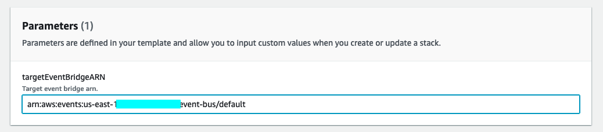

# AWS-crossRegion-eventBridge

This project is a sample to create Event Bridge rule to capture EC2 status change & AWS health event in different AWS region, and send them to one target region Event bridge. All these Event Bridge rules are managed by Stack Set to simplify management workload.

## Architecture 

## Deployment

### Create Stack Set pre-request roles 
To use Stack Set to deploy cloudformation template in different region, trust relationship needs to be setup between administrator account and all target accounts by roles. In this sample, Administration role and Executor role are setup in same account. Sample template: [AWS-StackSet-roles-template](cloudformation/AWS-StackSet-roles-template.yml)

Gather AdministratorAccountId

### Deploy Event Bridge rules in target regions using Stack Set
Sample Event Bridge rules will capture EC2 status & AWS health event, and deliver them to target Event Bridge. Sample template: [AWSEventBridge-template](cloudformation/AWSEventBridge-template.yaml)

Create Stack Set & input target Event bridge ARN

### Deployment result

## Extension & test
This sample co-works with [AWS-Lambda-notifier](https://github.com/Chris-wa-He/AWS-Lambda-notifier) solution, all notifications from different AWS region can be gathered in one IM client.

Deploy these two solutions and start EC2 in different AWS region, test result will as below:
